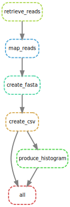
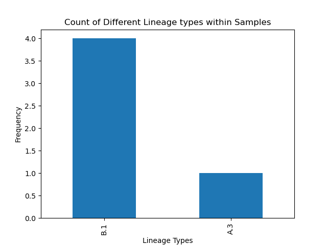

<!-- README TITLE -->
# BIOF501A Final Project: Automating lineage recognition from COVID19 reads 

<!-- TABLE OF CONTENTS -->
## Table of Contents

* [Project Information](#project-information)
  + [Dependencies](#dependencies)
* [Getting Started](#getting-started)
  + [Directed Acyclic Graph (DAG) of Pipeline](#dag)
  + [Installation](#installation)
* [Usage](#usage)
  + [Explanation](#explanation)
* [Expected Output](#expected-output)
* [Team Members](#Team-members)
* [References](#References)

***
<!-- PROJECT INFORMATION -->
## Project Information

This is the repository for the *BIOF501A Final Project* . 

### Background Information and Hypothesis

COVID-19 is a global pandemic and represents one of the toughest health challenges in 2020 [[1]](#1). As cases and mortality have been rapidly increasing over the past months, the need of rapid information regarding COVID-19 sequences for scientists and clinicians have increased dramatically [[1]](#1). While existing COVID-19 pipelines for sequencing have been developed [[2]](#2). To my knowledge, few pipelines have utilized the [https://github.com/cov-lineages/pangolin](Phylogenetic Assignment of Named Global Outbreak LINeages (PANGOLIN) software), which is a software that can rapidly detect the lineage from a given _fasta_ file. Overall, 5 FASTQ samples submitted by the **Delaware Public Health Lab** to the National Center for Biotechnology Information (NCBI) Sequence Read Archive (SRA) have been identified and will be used to demonstrate the validity of this pipeline. As the US is seeing unprecendented rise in the number of COVID cases, rapid and urgent responses must be done as quickly as possible, and this pipeline offers an expedient manner of collecting lineage. Theoretically, this may be relevant clinically relevant as physicians might notice that a cluster of cases have a common lineage, which may inform they of either a superspread event occuring or whether distinct, separate local outbreaks are occuring. While currently only 1 sample is processed, more can be used in the imaginable future if this pipeline is further developed. Based on previous literature which suggest that type A and type C are found in significant proportions in Europeans and Americans, I hypothesize that the majority of samples will be either type A or type B lineage[[3]](#3). Note that for this analysis, only paired-end reads data was used.

### Dependencies

Currently, [https://ubc-mds.github.io/resources_pages/install_ds_stack_mac/#git](git) and [https://docs.conda.io/en/latest/miniconda.html](Miniconda) are required to run this program. It will be implicitly assumed that users have this already installed.

***
<!-- GETING STARTED -->

## Getting Started

Before getting started, note that the reference sequence has already been provided for convenience, and can be found [https://www.ncbi.nlm.nih.gov/nuccore/1798174254](here). Briefly, the pipeline was built with `Snakemake` and is split into the following steps:

1. Extracting FASTQ reads through the `sra-toolkit`.
2. Mapping the reads to the reference sequence using `minimap2`.
3. Creating _fasta_ file through `samtools`. 
4. Running `pangolin` to generate a _.csv_ file of the result. 
5. Creating a histogram using `matplotlib` of the lineages counts.

### Directed Acyclic Graph (DAG) of Pipeline
 

### Installation

To clone the repository, run the following shell command: 
```sh
git clone https://github.com/zhemingfan/biof501a-mbb659_jeremy_fan.git
```

***
<!-- USAGE -->

## Usage 

Once the repository has been downloaded, more effort needs to be done to get the full installation. Unfortunately, an _environment.yml_ could not be provided as `pangolin` must be downloaded in a specific manner. 

Start by following the normal [https://github.com/cov-lineages/pangolin](pangolin installation):
1. Clone the repository at a location of your choosing.
```sh
git clone https://github.com/cov-lineages/pangolin.git 
```
2. Go into the `pangolin` folder. 
```sh
cd pangolin
```
3. Create the `conda` environment file.
```sh
conda env create -f environment.yml
```
4. Activate the `conda` environment.
```sh
conda activate pangolin
```
5. Run _setup.py_ the file to finalize installation
```sh
python setup.py install
```

In one chunk, this is:
```sh
git clone https://github.com/cov-lineages/pangolin.git 
cd pangolin
conda env create -f environment.yml
conda activate pangolin
python setup.py install
```

Afterwards, install a suite of tools from bioconda, conda-forge, and conda. 
```sh
conda install -c bioconda sra-tools samtools=1.9 openssl=1.0 bcftools seqtk 
conda install -c conda-forge matplotlib
conda install pandas
```

To run the pipeline, go into the directory containing the _Snakemake_ file, make sure the `pangolin` conda environment is activated and run the following: 
```sh
snakemake --cores 1   
```

The total expected running time should be at most 10 minutes (excluding data download, which may take the longer).

### Explanation

1. Extracting FASTQ reads through the `sra-toolkit`.
    -`fasterq-dump --split-files SRR12960723 -O data`: `fasterq-dump` is a faster way to extract _fastq_ files from the `sra-toolkit`. `--split-files` indicate split reads, and the `-O` flag suggests output to a directory called _data_ 
    -afterwards, a `cat` is run to append the two paired ends read files together. If successful, remove the individual _fastq_ to save storage space

2. Mapping the reads to the reference sequence using `minimap2`.
    -`minimap2` is a [https://github.com/lh3/minimap2](general purpose alligner), but largely maintains much of the performance as `bwa-mem` for short reads. the `-ax sr` flag is added to specify short reads. `samtools` is then called to sort the data by leftmost coordinates
        -for the future, if ever long reads are added to this pipeline, `minimap2` would make an ideal choice 

3. Creating _fasta_ file through `samtools`. 
    -the following steps are adapted from an answer from [https://www.biostars.org/p/367626/](Biostars). Briefly, `mpileup`produces "pileup" textual format from an alignment
    -


4. Running `pangolin` to generate a _.csv_ file of the result. 
    -`pangolin` is fairly self contained - basically a linear model is built and then run 
5. Creating a histogram using `matplotlib` of the lineages counts.


***
<!-- EXPECTED OUTPUT -->
## Expected Output 



***
<!-- TEAM -->
## Team-members

**Team Member** | **Degree** | **PI** | **Hobbies** 
------ | ---------- | -------- | ------
Jeremy Fan | Bioinformatics | Steven Jones | Annoying my roommate by cooking instant noodles at 3 AM 
***

<!-- REFERENCES -->
## References
<a id="1">[1]</a> 
Lee, M. (2020). Clinical Characteristics Of Early Noncritical Hospitalized Patients With Coronavirus Disease 2019 (Covid-19): A Single-Center Retrospective Study In New York City. doi:10.26226/morressier.5ebc261fffea6f735881a237

<a id="2">[2]</a> 
Nasir, Jalees A., Robert A. Kozak, Patryk Aftanas, Amogelang R. Raphenya, Kendrick M. Smith, Finlay Maguire, Hassaan Maan et al. "A Comparison of Whole Genome Sequencing of SARS-CoV-2 Using Amplicon-Based Sequencing, Random Hexamers, and Bait Capture." Viruses 12, no. 8 (2020): 895.
https://doi.org/10.3390/v12080895

<a id="3">[3]</a> 
Peter Forster, Lucy Forster, Colin Renfrew, Michael Forster. "Phylogenetic network analysis of SARS-CoV-2 genomes". Proceedings of the National Academy of Sciences Apr 2020, 117 (17) 9241-9243; DOI: 10.1073/pnas.2004999117

