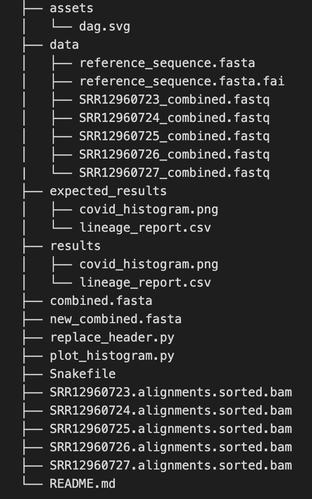

<!-- README TITLE -->
# BIOF501A Final Project: Automating lineage recognition from COVID19 reads 

<!-- TABLE OF CONTENTS -->
## Table of Contents

* [Project Information](#project-information)
  + [Dependencies](#dependencies)
* [Getting Started](#getting-started)
  + [Directed Acyclic Graph (DAG) of Pipeline](#dag)
  + [Installation](#installation)
* [Usage](#usage)
  + [Explanation](#explanation)
  + [Input](#input)
  + [Ouput](#output)
* [Expected Output](#expected-output)
* [Team Members](#Team-members)
* [References](#References)

***
<!-- PROJECT INFORMATION -->
## Project Information

This is the repository for the *BIOF501A Final Project* . 

### Background Information and Hypothesis

COVID-19 is a global pandemic and represents one of the toughest health challenges in 2020 [[1]](#1). As cases and mortality have been rapidly increasing over the past months, the need of rapid information regarding COVID-19 sequences for scientists and clinicians have increased dramatically [[1]](#1). While existing COVID-19 pipelines for sequencing have been developed [[2]](#2). To my knowledge, few pipelines have utilized the [Phylogenetic Assignment of Named Global Outbreak LINeages (PANGOLIN) software](https://github.com/cov-lineages/pangolin]), which is a software that can rapidly detect the lineage from a given _fasta_ file. Overall, 5 FASTQ samples submitted by the **Delaware Public Health Lab** to the National Center for Biotechnology Information (NCBI) Sequence Read Archive (SRA) have been identified and will be used to demonstrate the validity of this pipeline. As the US is seeing unprecendented rise in the number of COVID cases, rapid and urgent responses must be done as quickly as possible, and this pipeline offers an expedient manner of collecting lineage. Theoretically, this may be relevant clinically relevant as physicians might notice that a cluster of cases have a common lineage, which may inform they of either a superspread event occuring or whether distinct, separate local outbreaks are occuring. While currently only 1 sample is processed, more can be used in the imaginable future if this pipeline is further developed. Based on previous literature which suggest that type A and type C are found in significant proportions in Europeans and Americans, I hypothesize that the majority of samples will be either type A or type B lineage[[3]](#3). Note that for this analysis, only paired-end reads data was used.

### Dependencies

Currently, [git](https://ubc-mds.github.io/resources_pages/install_ds_stack_mac/#git) and [Miniconda](https://docs.conda.io/en/latest/miniconda.html) are required to run this program. It will be implicitly assumed that users have this already installed.

***
<!-- GETING STARTED -->

## Getting Started

Before getting started, note that the reference sequence has already been provided for convenience, and can be found [here](https://www.ncbi.nlm.nih.gov/nuccore/1798174254). Briefly, the pipeline was built with `Snakemake` and is split into the following steps:

1. Extracting FASTQ reads through the `sra-toolkit`.
2. Mapping the reads to the reference sequence using `minimap2`.
3. Creating _fasta_ file through `samtools`. 
4. Running `pangolin` to generate a _.csv_ file of the result. 
5. Creating a histogram using `matplotlib` of the lineages counts.

### Directed Acyclic Graph (DAG) of Pipeline
 

### Installation

To clone the repository, run the following shell command: 
```sh
git clone https://github.com/zhemingfan/biof501a-mbb659_jeremy_fan.git
```

***
<!-- USAGE -->

## Usage 

Once the repository has been downloaded, more effort needs to be done to get the full installation. Unfortunately, an _environment.yml_ could not be provided as `pangolin` must be downloaded in a specific manner. 

Start by following the normal [pangolin installation](https://github.com/cov-lineages/pangolin):
1. Clone the repository at a location of your choosing.
```sh
git clone https://github.com/cov-lineages/pangolin.git 
```
2. Go into the `pangolin` folder. 
```sh
cd pangolin
```
3. Create the `conda` environment file.
```sh
conda env create -f environment.yml
```
4. Activate the `conda` environment.
```sh
conda activate pangolin
```
5. Run _setup.py_ the file to finalize installation
```sh
python setup.py install
```

In one chunk, this is:
```sh
git clone https://github.com/cov-lineages/pangolin.git 
cd pangolin
conda env create -f environment.yml
conda activate pangolin
python setup.py install
```

Afterwards, install a suite of tools from bioconda, conda-forge, and conda. Check yes to everything.
```sh
conda install -c bioconda sra-tools samtools=1.9 openssl=1.0 bcftools seqtk 
conda install -c conda-forge matplotlib
conda install pandas
```

To run the pipeline, go into the directory containing the _Snakemake_ file, make sure the `pangolin` conda environment is activated and run the following: 
```sh
snakemake --cores 1   
```

The total expected running time should be at most 10 minutes (excluding data download, which may take the longer).

### Explanation

1. Extracting FASTQ reads through the `sra-toolkit`.
    -`fasterq-dump --split-files SRR12960723 -O data`: `fasterq-dump` is a faster way to extract _fastq_ files from the `sra-toolkit`. `--split-files` indicate split reads, and the `-O` flag suggests output to a directory called _data_ 
    -afterwards, a `cat` is run to append the two paired ends read files together. If successful, remove the individual _fastq_ to save storage space

2. Mapping the reads to the reference sequence using `minimap2`.
    -`minimap2` is a [https://github.com/lh3/minimap2](general purpose alligner), but largely maintains much of the performance as `bwa-mem` for short reads. the `-ax sr` flag is added to specify short reads. `samtools` is then called to sort the data by leftmost coordinates
        -for the future, if ever long reads are added to this pipeline, `minimap2` would make an ideal choice 

3. Creating _fasta_ file through `samtools`. 
    -the following steps are adapted from an answer from [https://www.biostars.org/p/367626/](Biostars). Briefly, `mpileup`produces "pileup" textual format from an alignment. then an eventual "consensus" of the most frequently occuring base at each spot is generated through `bcftools call` and `vcfutils.pl vcf2fq`. This practically does the same as `bcftools consensus`.

4. Running `pangolin` to generate a _.csv_ file of the result. 
    -`pangolin` is fairly self contained package - basically a multinomial logistic regression model built using 30,000 SARS-CoV-2 sequences from GISAID

5. Creating a histogram using `matplotlib` of the lineages counts.
    -`pandas` is used to read the _csv_ file
    -`matplotlib` has a built in histogram feature that can be called with 

### Input

The first input file provided in the data folder is a sequence of the _Severe acute respiratory syndrome coronavirus 2 isolate Wuhan-Hu-1, complete genome_. This file follows traditional FASTA format (one line header starting with ">" following a sequence of nucleotides in the second line). Five additional _fastq_ files can be found from SRA, for instance one of the read file is [here](https://www.ncbi.nlm.nih.gov/sra/?term=SRR12960723). All of the read files are standard, and are paired-ends, thus accounting for why later a `cat` command will be run to merge them. 

### Output

After running the pipeline, the final directory should look something similar to below (note hidden files are excluded):

 

To be noted: 

1. _combined.fasta_ is a _fasta_ file with the combined _fasta_ from all the samples.
2. _newcombined.fasta_ is another file except all the headers are changed to allow analysis (previously all headers were the same)
3. A series of _.bam_ files such as _SRR12960723.alignments.sorted.bam_ are the results of the allignment between reads and the reference genome provided.
4. Within the results folder, there will be two new files
    - lineage_report.csv which provides a report on the samples and the lineage they were called
    - covid_histogram.png which provides a visual perspective of the same data in the lineage report

Overall, while lineages A and C were anticipated, most samples were classified as lineage B.1. In other manuscripts, however, the B.1 lineage has also spread to North America, and was noted to start in New York City [[4]](#4)[[5]](#5). This specific lineage contains a specific mutation (D614G) within the Spike protein that has been been linked with higher contagion [[6]](#6). Newer reports seem to indicate that both B.1 and A.3 have also been commonly observed across the United States [[7]](#7). However, as the sample size was only limited to 5, it is difficult to come with definitive conclusions about which lineages are most common in Delaware. As more data is later acquired, more evidence can be brought up and perhaps targeted therapies at specific mutations in specific lineages may arise. 

***
<!-- EXPECTED OUTPUT -->
## Expected Output 


***
<!-- TEAM -->
## Team-members

**Team Member** | **Degree** | **PI** | **Hobbies** 
------ | ---------- | -------- | ------
Jeremy Fan | Bioinformatics | Steven Jones | Annoying my roommate by cooking instant noodles at 3 AM 
***

<!-- REFERENCES -->
## References
<a id="1">[1]</a> 
Lee, M. (2020). Clinical Characteristics Of Early Noncritical Hospitalized Patients With Coronavirus Disease 2019 (Covid-19): A Single-Center Retrospective Study In New York City. doi:10.26226/morressier.5ebc261fffea6f735881a237

<a id="2">[2]</a> 
Nasir, Jalees A., Robert A. Kozak, Patryk Aftanas, Amogelang R. Raphenya, Kendrick M. Smith, Finlay Maguire, Hassaan Maan et al. "A Comparison of Whole Genome Sequencing of SARS-CoV-2 Using Amplicon-Based Sequencing, Random Hexamers, and Bait Capture." Viruses 12, no. 8 (2020): 895.
https://doi.org/10.3390/v12080895

<a id="3">[3]</a> 
Peter Forster, Lucy Forster, Colin Renfrew, Michael Forster. "Phylogenetic network analysis of SARS-CoV-2 genomes". Proceedings of the National Academy of Sciences Apr 2020, 117 (17) 9241-9243; DOI: 10.1073/pnas.2004999117

<a id="4">[4]</a> 
Worobey M, Pekar J, Larsen BB, et al. The emergence of SARS-CoV-2 in Europe and the US. Preprint. bioRxiv. 2020;2020.05.21.109322. Published 2020 May 23. doi:10.1101/2020.05.21.109322

<a id="5">[5]</a> 
Maurano M. T., Ramaswami S., Westby G., Zappile P., Dimartino D., Shen G., Feng X., Ribeiro-dos-Santos A. M., Vulpescu N. A., Black M., Hogan M., Marier C., Meyn P., Zhang Y., Cadley J., Ordonez R., Luther R., Huang E., Guzman E., Serrano A., Belovarac B., Gindin T., Lytle A., Pinnell J., Vougiouklakis T., Boytard L., Chen J., Lin L. H., Rapkiewicz A., Raabe V., Samanovic-Golden M. I., Jour G., Osman I., Aguero-Rosenfeld M., Mulligan M. J., Cotzia P., Snuderl M., Heguy A., Sequencing identifies multiple, early introductions of SARS-CoV2 to New York City Region. medRxiv (2020), , doi:10.1101/2020.04.15.20064931

<a id="6">[6]</a> 
Korber B., Fischer W. M., Gnanakaran S., Yoon H., Theiler J., Abfalterer W., Foley B., Giorgi E. E., Bhattacharya T., Parker M. D., Partridge D. G., Evans C. M., Freeman T. M., de Silva T. I., on behalf of the Sheffield COVID-19 Genomics Group, LaBranche C. C., Montefiori D. C., Spike mutation pipeline reveals the emergence of a more transmissible form of SARS-CoV-2. bioRxiv (2020), p. 2020.04.29.069054.

<a id="7">[7]</a> 
Ladner JT, Larsen BB, Bowers JR, Hepp CM, Bolyen E, Folkerts M, Sheridan K, Pfeiffer A, Yaglom H, Lemmer D, Sahl JW, Kaelin EA, Maqsood R, Bokulich NA, Quirk G, Watts TD, Komatsu K, Waddell V, Lim ES, Caporaso JG, Engelthaler DM, Worobey M, Keim P. 2020. An early pandemic analysis of SARS-CoV-2 population structure and dynamics in Arizona. mBio 11:e02107-20. https://doi.org/10.1128/mBio.02107-20.